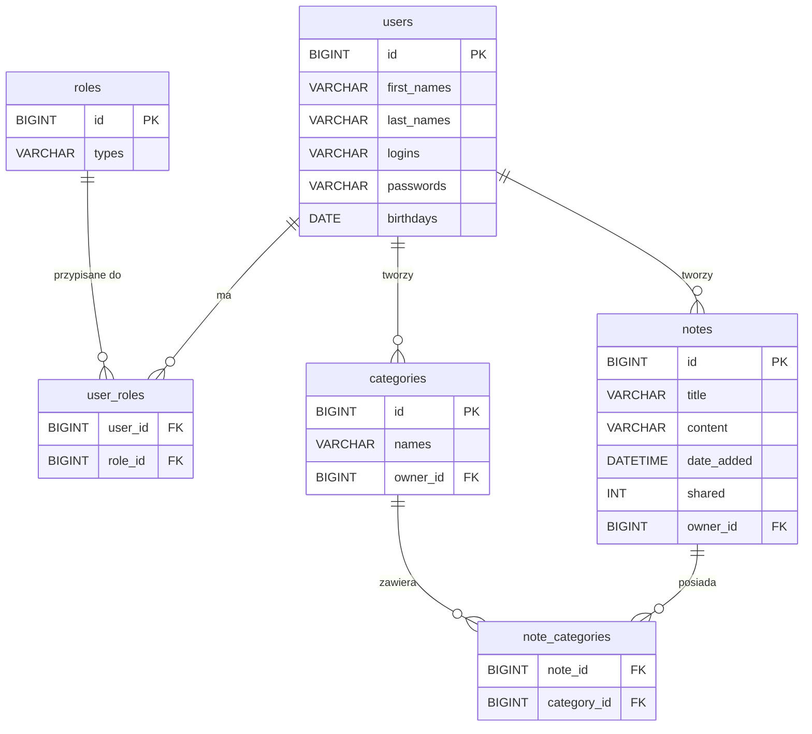

# Diagram relacyjnej bazy danych

Poniższy diagram przedstawia strukturę relacyjnej bazy danych używanej w projekcie.

```mermaid
erDiagram
    users {
        BIGINT id PK
        VARCHAR first_names
        VARCHAR last_names
        VARCHAR logins
        VARCHAR passwords
        DATE birthdays
    }
    roles {
        BIGINT id PK
        VARCHAR types
    }
    user_roles {
        BIGINT user_id FK
        BIGINT role_id FK
    }
    categories {
        BIGINT id PK
        VARCHAR names
        BIGINT owner_id FK
    }
    notes {
        BIGINT id PK
        VARCHAR title
        VARCHAR content
        DATETIME date_added
        INT shared
        BIGINT owner_id FK
    }
    note_categories {
        BIGINT note_id FK
        BIGINT category_id FK
    }

    users ||--o{ user_roles : "ma"
    roles ||--o{ user_roles : "przypisane do"
    users ||--o{ categories : "tworzy"
    users ||--o{ notes : "tworzy"
    notes ||--o{ note_categories : "posiada"
    categories ||--o{ note_categories : "zawiera"
```
